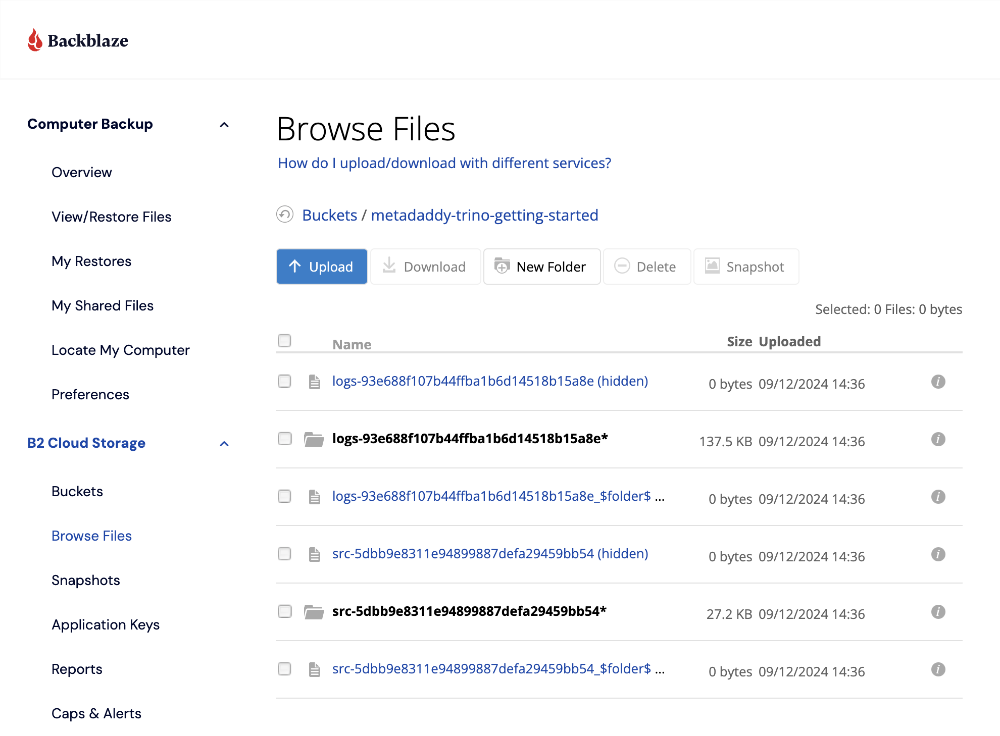
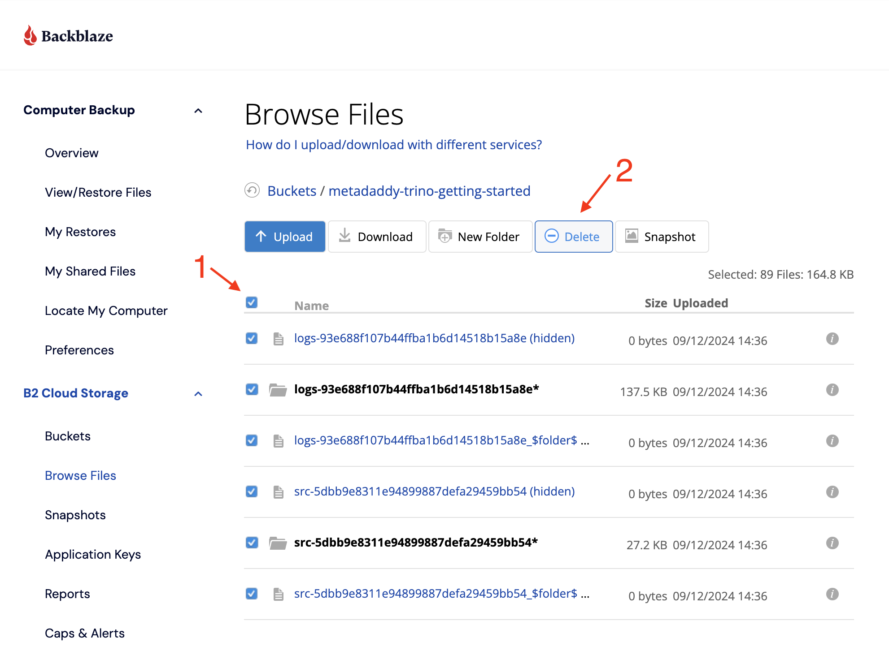

# Iceberg with the Hive Metastore and Backblaze B2 Cloud Storage

This tutorial shows how to use Trino and the [Apache Iceberg](https://iceberg.apache.org/) table format, using the Hive metastore for table metadata and [Backblaze B2 Cloud Storage](https://www.backblaze.com/cloud-storage) for file storage. The [Perform DML Operations with Iceberg on Trino](#perform-dml-operations-with-iceberg-on-trino) section is closely based on the demo in [Trino Community Broadcast
40: Trino's cold as Iceberg!](https://trino.io/episodes/40.html) 

## Create a Backblaze Account

If you already have a Backblaze account with B2 enabled, you can skip to the next section.

<a name="enable-b2-existing-account"></a>
If you have a Backblaze account, but you don't see the **B2 Cloud Storage** menu on the left after you sign in, then you need to enable Backblaze B2 for your account. On the left, under Account, click **My Settings**, then, under Enabled Products, click the checkbox for **B2 Cloud Storage**.


The page will refresh, and you will see the B2 Cloud Storage menu on the left.

If you do not yet have a Backblaze account, navigate to the [Backblaze B2 signup page](https://www.backblaze.com/b2/sign-up.html?referrer=nopref), enter your email address and a password, and click **Sign Up for Backblaze B2**. Your account includes 10 GB of storage free of charge, and you don't need to submit any credit card details until you need more.

## Create a Bucket in Backblaze B2

Creating a bucket gives us a location to write our data to; we can tell Trino where to find it.


[Sign in to Backblaze B2](https://www.backblaze.com/user_signin.htm), and, in the **B2 Cloud Storage** menu on the left, click **Buckets**.


If you don't see the B2 Cloud Storage menu, you need to [enable B2 on your Backblaze account](#enable-b2-existing-account).

Click **Create a Bucket** and give the bucket a name. We're using `trino-iceberg` in this tutorial, since we will be working with Iceberg, but you will need to choose your own bucket name, since bucket names in Backblaze B2 must be globally unique.


Leave the remaining settings with their defaults and click **Create a Bucket**.

Make a note of the endpoint value in the bucket details; you'll need that to configure Trino in a moment. The region is the second part of the endpoint - for example, in the endpoint `s3.us-west-004.backblazeb2.com`, the region is `us-west-004`. Note that you must use the full `https` URL for `ENDPOINT`; for example, `https://s3.us-west-004.backblazeb2.com`.


## Create an Application Key in Backblaze B2

Now you have a bucket in Backblaze B2, you have to create an application key that Trino's Iceberg connector can use to access it. In the menu on the left, under **Account**, click **App Keys**, then click **Add a New Application Key**.

It's good practice to limit a key to access a single bucket if you can, so give the key a name, again, we're using `trino-iceberg` as an example, and select the bucket you created in the **Allow Access to Bucket(s)** dropdown. Many tools require the ability to list all of the buckets in an account, even if they will only be using a single bucket, so enable **Allow List All Bucket Names**. Leave the remaining settings with their defaults and click **Create New Key**.


**IMPORTANT**: You MUST copy the application key immediately after you create it. You cannot access the key after you leave this page. Make a note of the key id as well as the application key.


## Configure Trino

We need to configure both Trino's Iceberg Connector and the Hive metastore to access the bucket in Backblaze B2. There are several edits across three configuration files, so, before you start, ensure you have the required information to hand. The configuration files contain the following placeholders:

* `BUCKET_NAME`
* `APPLICATION_KEY`
* `KEY_ID`
* `ENDPOINT`
* `REGION`

`BUCKET_NAME` is simply the name of the bucket you created; you should have a note of `APPLICATION_KEY`, `KEY_ID`, `ENDPOINT` and `REGION` from creating the bucket and application key earlier.

Edit each of the following three files and replace the placeholders with your values:

* `conf/core-site.xml`
* `conf/metastore-site.xml`
* `etc/catalog/iceberg.properties`

For example, in `conf/core-site.xml`, the first edit is to change `BUCKET_NAME` to the name of your bucket. i.e. change

```xml
    <property>
        <name>fs.defaultFS</name>
        <value>s3a://BUCKET_NAME</value>
    </property>
```

to

```xml
    <property>
        <name>fs.defaultFS</name>
        <value>s3a://trino-iceberg</value>
    </property>
```

replacing `trino-iceberg` with the name of your bucket.

Once you've completed editing the configuration files, make sure you save them!

## Run Trino and its Associated Services

Now, you can start Trino, the Hive metastore and the MariaDB instance that Hive uses. Make sure that you are in the
`trino-getting-started-b2/iceberg/trino-iceberg-hive-b2` directory then run the following
command:

```
docker compose up -d
```

You should expect to see the following output (you will also see Docker downloading the images, if you do not already have them stored locally):

```
[+] Running 5/5
 ✔ Network trino-iceberg-hive-b2_trino-network          Created 0.0s 
 ✔ Volume "trino-iceberg-hive-b2_maria_volume"          Created 0.0s 
 ✔ Container trino-iceberg-hive-b2-mariadb-1            Started 0.4s 
 ✔ Container trino-iceberg-hive-b2-trino-coordinator-1  Started 0.4s 
 ✔ Container trino-iceberg-hive-b2-hive-metastore-1     Started 0.5s
```

Follow the Trino coordinator's log file until you see that the server has started:

```console
% docker logs -f trino-iceberg-hive-b2-trino-coordinator-1
...
2024-09-12T20:37:19.617Z	INFO	main	io.trino.connector.StaticCatalogManager	-- Added catalog iceberg using connector iceberg --
2024-09-12T20:37:19.622Z	INFO	main	io.trino.security.AccessControlManager	Using system access control: default
2024-09-12T20:37:19.644Z	INFO	main	io.trino.server.Server	Server startup completed in 11.56s
2024-09-12T20:37:19.644Z	INFO	main	io.trino.server.Server	======== SERVER STARTED ========
```

When you see `SERVER STARTED`, you can kill `docker logs` with Ctrl-C.

## Open the Trino CLI

Once this is complete, you can log into the Trino coordinator node. We will
do this by using the [`exec`](https://docs.docker.com/engine/reference/commandline/exec/)
command and run the `trino` CLI executable on that
container. Notice the container id is `trino-iceberg-hive-b2-trino-coordinator-1` so the
command you will run is:

```
docker container exec -it trino-iceberg-hive-b2-trino-coordinator-1 trino
```

You should see the `trino` cursor once the startup
is complete:
```
trino>
```

## Perform DML Operations with Iceberg on Trino

The Iceberg table format implements advanced features such as hidden partitioning, table evolution, and snapshots.

First, create a schema using the `iceberg` catalog. In place of `trino-iceberg`, specify the bucket you created in Backblaze B2:

```sql
CREATE SCHEMA iceberg.logging
WITH (location = 's3a://trino-iceberg/');
```

Now you can create a table. Note the use of the `format_version` property to specify the Iceberg specification format. The default is `2`, which allows row-level deletes.

```sql
CREATE TABLE iceberg.logging.logs (
  level varchar NOT NULL,
  event_time timestamp(6) with time zone NOT NULL,
  message varchar NOT NULL,
  call_stack array(varchar)
)
WITH (
  format_version = 2,
  format = 'ORC',
  partitioning = ARRAY['day(event_time)','level']
);
```

Insert two records. Notice the `event_time` values are on the same day, but different hours.

```sql
INSERT INTO iceberg.logging.logs VALUES
(
  'ERROR',
  timestamp '2021-04-01 12:23:53.383345' AT TIME ZONE 'America/Los_Angeles',
  '1 message',
  ARRAY ['Exception in thread "main" java.lang.NullPointerException']
),
(
  'ERROR',
  timestamp '2021-04-01 13:36:23' AT TIME ZONE 'America/Los_Angeles',
  '2 message',
  ARRAY ['Exception in thread "main" java.lang.NullPointerException']
);
```

Take a look at the data in the table, and the `$partitions` metadata table:

```sql
SELECT * FROM iceberg.logging.logs;
SELECT * FROM iceberg.logging."logs$partitions";
```

Notice that a single partition was created to store both records, since the table definition specified partitioning by the day of the event time, then the level.

Now update the partitioning from daily to hourly:


```sql
ALTER TABLE iceberg.logging.logs
SET PROPERTIES partitioning = ARRAY['hour(event_time)'];
```

Insert three more records. Notice that the `event_time` values are on the same day but span different hours.

```sql
INSERT INTO iceberg.logging.logs VALUES
(
  'ERROR',
  timestamp '2021-04-01 15:55:23' AT TIME ZONE 'America/Los_Angeles',
  '3 message',
  ARRAY ['Exception in thread "main" java.lang.NullPointerException']
),
(
  'WARN',
  timestamp '2021-04-01 15:55:23' AT TIME ZONE 'America/Los_Angeles',
  '4 message',
  ARRAY ['bad things could be happening']
),
  (
  'WARN',
  timestamp '2021-04-01 16:55:23' AT TIME ZONE 'America/Los_Angeles',
  '5 message',
  ARRAY ['bad things could be happening']
);
```

Take another look at the data and metadata:

```sql
SELECT * FROM iceberg.logging.logs;
SELECT * FROM iceberg.logging."logs$partitions";
```

Now there are three partitions:
1) One partition at the day granularity containing our original records.
2) A partition at the hour granularity for hour 15 containing two new records.
3) A second partition at the hour granularity for hour 16 containing the last new record.

Run this query:

```sql
SELECT * FROM iceberg.logging.logs
WHERE event_time < timestamp '2021-04-01 16:55:23' AT TIME ZONE 'America/Los_Angeles';
```

The query correctly returns 4 records with only the first two partitions being touched.

Now let's check the `$snapshots` metadata table:

```sql
SELECT * FROM iceberg.logging.logs;
SELECT * FROM iceberg.logging."logs$snapshots";
```

Update the `warn` level log records:

```sql
UPDATE
  iceberg.logging.logs
SET
  call_stack = call_stack || 'WHALE HELLO THERE!'
WHERE
  lower(level) = 'warn';
```

Now take another look at `$snapshots`:

```sql
SELECT * FROM iceberg.logging.logs;
SELECT * FROM iceberg.logging."logs$snapshots";
```

You can read data from an old snapshot - time travel!

Change the snapshot ID in the following statement to the second `snapshot_id` value from the previous results to show the data as it was after the first `INSERT`:  

```sql
SELECT * FROM iceberg.logging.logs FOR VERSION AS OF 2806470637437034115;
```

Now let's see the `MERGE` statement in action. First, create a second table, and insert some rows:

```sql
CREATE TABLE iceberg.logging.src (
  level varchar NOT NULL,
  message varchar NOT NULL,
  call_stack array(varchar)
)
WITH (
  format = 'ORC'
);

INSERT INTO iceberg.logging.src VALUES
(
  'ERROR',
  '3 message',
  ARRAY ['This one will not show up because it is an ERROR']
),
(
  'WARN',
  '4 message',
  ARRAY ['This should show up']
),
(
  'WARN',
  '5 message',
  ARRAY ['This should show up as well']
);
```

Next, you'll merge the `src` table into `logs`, the target table for the `MERGE` operation.

The following statement associates rows from the two tables using their `message` fields. If the `message` fields match, and the source row's `level` is `ERROR`, then the corresponding row is deleted from the target table; otherwise, matching rows in the target table have their message updated to the source row's message concatenated with the string `-updated`, and their `call_stack` concatenated with the source row's `call_stack`.

```sql
MERGE INTO iceberg.logging.logs AS t
USING iceberg.logging.src AS s
ON s.message = t.message
WHEN MATCHED AND s.level = 'ERROR'
  THEN DELETE
WHEN MATCHED
  THEN UPDATE
    SET message = s.message || '-updated',
      call_stack = s.call_stack || t.call_stack;
```

Query the `logs` table again to see the effect:

```sql
SELECT * FROM iceberg.logging.logs;
```

Notice that there are only four records, since one was deleted, and the two `WARN` rows' `message` fields have been updated.

You're done! You can drop the tables and schemas, if you wish, or continue to experiment.

```sql
DROP TABLE iceberg.logging.src;
DROP TABLE iceberg.logging.logs;
DROP SCHEMA iceberg.logging;
```

## Cleanup

By default, dropping the tables in Trino does not delete the underlying metadata and data files. If you log in to Backblaze and navigate to your bucket, you will see them:



You can delete all of the files by selecting them all, then hitting the 'delete' button:


